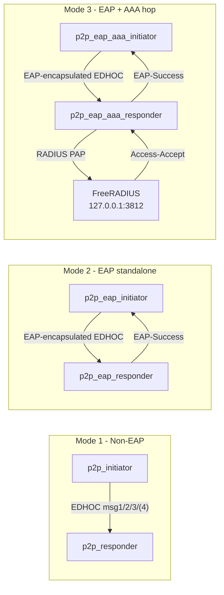

# EDHOC PQ Benchmark Workspace

Benchmark handshake EDHOC pasca-kuantum (PQ) untuk lima varian draft
**PAPOn** (Section 2, 3.2, 3.3, 3.4, 3.5) dengan tiga skenario
benchmark yang sebanding section-by-section:

1. **Non-EAP (baseline)** - EDHOC murni di atas UDP loopback.
2. **EAP standalone** - EDHOC dibungkus EAP-Request/Response, NAS
   menerbitkan `EAP-Success` sendiri.
3. **EAP + AAA hop** - sama seperti (2), ditambah satu round-trip
   RADIUS Access-Request/Access-Accept ke server FreeRADIUS lokal
   sehingga kita bisa memisahkan biaya AAA dari biaya kripto/EAP.

Lima varian PAPOn yang ditangani:

| Section   | Mode kriptografi yang diuji            | Catatan |
| --------- | -------------------------------------- | ------- |
| Section2  | I = Sign, R = Sign-KEM                 | 3 message |
| Section32 | I = Sign, R = Sign-(KEM+Sign)          | 3 message |
| Section33 | I = KEM,  R = (KEM+Sign)               | 4 message + ack |
| Section34 | I = KEM,  R = Sign                     | 4 message + ack |
| Section35 | I = KEM,  R = KEM                      | 4 message + ack |

Algoritma yang dipakai untuk operasi kripto (lewat PQClean dan
mbedTLS/libsodium):

- **KEM**: ML-KEM-768 (PQClean clean reference).
- **Signature**: ML-DSA-65 (PQClean clean reference).
- **Hash / KDF**: SHA-256 + HKDF (mbedTLS).
- **AEAD**: ChaCha20-Poly1305 (libsodium) untuk pesan EDHOC yang
  membutuhkan AEAD; SHAKE/SHA-2 dipakai oleh PQClean common.
- **MD5 / HMAC-MD5**: hanya untuk encoding RADIUS PAP +
  Message-Authenticator (RFC 2865 / RFC 3579), bukan untuk EDHOC.

Hasil benchmark ditulis ke `output/*.csv`. Skrip
`scripts/merge_benchmarks.py` menggabungkan CSV per-mode menjadi satu
file ber-`;` agar mudah dibaca di spreadsheet.

## 1. Struktur repository

```
edhoc/
  src/                         <- source EDHOC + EAP + AAA + Makefile
    p2p_initiator.c            (mode 1: Non-EAP)
    p2p_responder.c
    p2p_eap_initiator.c        (mode 2: EAP standalone)
    p2p_eap_responder.c
    p2p_eap_aaa_initiator.c    (mode 3: wrapper -DBENCH_AAA / BENCH_TAG="_aaa")
    p2p_eap_aaa_responder.c
    eap_wrap.c / .h            (EAP framing + fragmentasi)
    edhoc_plaintext.c / .h     (lima varian PAPOn EDHOC)
    aaa_radius.c / .h          (klien RADIUS PAP + Message-Authenticator)
    pqclean_adapter.c / .h     (jembatan PQClean untuk KEM/Sign)
    benchmark.c / .h           (pengukuran waktu, RSS, fragmentasi)
    Makefile                   (build seluruh binary)
  build/                       <- artefak hasil build (auto-generated)
  scripts/
    freeradius_aaa/
      prepare.sh               (siapkan tree raddb v3 di output/)
      run_server.sh            (jalankan FreeRADIUS foreground)
      smoke_test.sh            (radclient PAP test)
    merge_benchmarks.py        (gabungkan CSV per-mode)
  lib/
    PQClean/                   (ML-KEM-768, ML-DSA-65 - submodule)
    uoscore-uedhoc/            (header mbedTLS, helper - submodule)
    freeradius-server/         (referensi v4 - submodule, opsional)
  output/                      <- hasil benchmark (CSV) + raddb FreeRADIUS
  docs/
    handshake_mermaid_eap_papon.md
    handshake_mermaid_aaa_papon.md          (3 aktor: Sup-NAS-AAA)
    edhoc_draft_alignment_matrix.md
    p2p_realcode_mermaid_section2_35.md
  README.md
```

## 2. Arsitektur tiga mode benchmark



Detil sequence diagram per section/varian ada di
[docs/handshake_mermaid_eap_papon.md](docs/handshake_mermaid_eap_papon.md)
dan [docs/handshake_mermaid_aaa_papon.md](docs/handshake_mermaid_aaa_papon.md).

## 3. Clone & install dependency

Workspace ini memakai submodule `lib/PQClean`,
`lib/uoscore-uedhoc`, dan `lib/freeradius-server` (opsional).

```bash
git clone <repo-url> edhoc
cd edhoc
git submodule update --init --recursive lib/PQClean lib/uoscore-uedhoc
# Submodule FreeRADIUS hanya dibutuhkan kalau ingin pakai source-tree v4
# (mode AAA juga jalan dengan FreeRADIUS sistem v3, lihat bagian 6).
git submodule update --init lib/freeradius-server || true
```

Dependency sistem (Ubuntu/Debian/Raspberry Pi OS):

```bash
sudo apt update
sudo apt install -y \
    build-essential pkg-config python3 \
    libsodium-dev libmbedtls-dev \
    freeradius freeradius-utils    # untuk mode AAA
```

Pada Raspberry Pi (arm64/armhf) cukup paket yang sama; build dilakukan
native di Pi. PQClean dan uoscore-uedhoc dibawa lewat submodule jadi
tidak perlu paket tambahan.

## 4. Build

```bash
cd src
make -j"$(nproc)"
```

Binary yang dihasilkan di `build/`:

| Binary                    | Mode                |
| ------------------------- | ------------------- |
| `p2p_initiator`           | Non-EAP, sisi I     |
| `p2p_responder`           | Non-EAP, sisi R     |
| `p2p_eap_initiator`       | EAP standalone, I   |
| `p2p_eap_responder`       | EAP standalone, R   |
| `p2p_eap_aaa_initiator`   | EAP + AAA hop, I    |
| `p2p_eap_aaa_responder`   | EAP + AAA hop, R    |

Wrapper `p2p_eap_aaa_*` adalah file 3-baris yang
`#define BENCH_AAA + BENCH_TAG "_aaa"` lalu `#include` source EAP yang
sama, sehingga tidak ada duplikasi logic.

Bersihkan artefak: `cd src && make clean`.

## 5. Run mode 1 (Non-EAP)

Argumen umum: `<port> <iter> <crypto_iter>`.
- `iter` = jumlah handshake yang diukur per section.
- `crypto_iter` = jumlah pengulangan untuk benchmark per-operasi kripto.

Terminal Responder:

```bash
./build/p2p_responder 9090 5 5
```

Terminal Initiator:

```bash
./build/p2p_initiator 127.0.0.1 9090 5 5
```

Output:
- `output/benchmark_crypto_{initiator,responder}.csv`
- `output/benchmark_fullhandshake_operation_p2p_{initiator,responder}.csv`
- `output/benchmark_fullhandshake_overhead_p2p_{initiator,responder}.csv`
- `output/benchmark_fullhandshake_processing_p2p_{initiator,responder}.csv`
- `output/internal_test_vectors_sections.csv`

## 6. Run mode 2 (EAP standalone)

Argumen tambahan: `<mtu> <eap_method_type>`.
- `mtu` ukuran maksimum payload EAP (untuk fragmentasi).
- `eap_method_type` default `57` (suggested di draft EAP-EDHOC).

Terminal Responder:

```bash
./build/p2p_eap_responder 9095 5 5 256 57
```

Terminal Initiator:

```bash
./build/p2p_eap_initiator 127.0.0.1 9095 5 5 256 57
```

Output tambahan dibanding mode 1:
- `output/benchmark_fragmentation_eap_{initiator,responder}.csv`
- `output/benchmark_eap_keymat_{initiator,responder}.csv` (MSK/EMSK).
- Versi EAP dari semua CSV mode 1 (`*_eap_*.csv`).

## 7. Run mode 3 (EAP + AAA, FreeRADIUS hop)

### 7.1 Siapkan FreeRADIUS sekali per workspace

```bash
sudo systemctl stop freeradius || true       # bebaskan port 1812
./scripts/freeradius_aaa/prepare.sh           # build raddb v3 di output/
```

`prepare.sh` akan:
- meniru `/etc/freeradius/3.0` ke `output/freeradius_aaa/raddb`
  (atau pakai submodule `lib/freeradius-server` kalau v3),
- mendengarkan UDP **3812** (auth) / **3813** (acct),
- mematikan modul EAP (kita bench hanya hop RADIUS, bukan EAP-in-RADIUS),
- menambahkan user PAP per section dan client `127.0.0.1` dengan
  shared secret `testing123`.

### 7.2 Jalankan FreeRADIUS

Terminal A (biarkan terbuka):

```bash
./scripts/freeradius_aaa/run_server.sh
```

Smoke test (opsional):

```bash
./scripts/freeradius_aaa/smoke_test.sh 127.0.0.1 3812 testing123 \
    edhoc_Section2 edhoc-pass
# Harus melihat 'Received Access-Accept'.
```

### 7.3 Jalankan benchmark

Terminal B (responder/NAS, jalankan dari root repo agar CSV ke
`output/`):

```bash
./build/p2p_eap_aaa_responder 9097 5 5 256 57
```

Terminal C (initiator/supplicant):

```bash
./build/p2p_eap_aaa_initiator 127.0.0.1 9097 5 5 256 57
```

Output tambahan:
- `output/benchmark_aaa_auth_p2p_eap_aaa_responder.csv` - kolom
  `section, calls, accepts, rejects, errors, rtt_avg_us,
  req_bytes_avg, resp_bytes_avg, total_bytes_avg`.
- Versi `_aaa` dari semua CSV mode 2.

User PAP per section yang dibikin oleh `prepare.sh`:

| Section   | User-Name        | Password    |
| --------- | ---------------- | ----------- |
| Section2  | `edhoc_Section2` | `edhoc-pass` |
| Section32 | `edhoc_Section32`| `edhoc-pass` |
| Section33 | `edhoc_Section33`| `edhoc-pass` |
| Section34 | `edhoc_Section34`| `edhoc-pass` |
| Section35 | `edhoc_Section35`| `edhoc-pass` |

## 8. Run terdistribusi (Initiator di Raspberry Pi, Responder di server)

Skenario yang sering dipakai untuk mengukur biaya pada perangkat
edge:

```
+-------------------+        EDHOC / EAP / RADIUS         +---------------+
| Raspberry Pi      |  <----------------------------->    |  Server       |
| p2p_eap_(aaa_)    |                                     |  p2p_eap_(aaa_) |
| initiator         |                                     |  responder    |
+-------------------+                                     |  freeradius   |
                                                          +---------------+
```

Langkah:

1. **Build di kedua sisi** (clone + `make -j` di repo masing-masing).
   Pastikan versi PQClean/mbedTLS sama.
2. **Buka firewall** di server untuk port handshake yang dipilih
   (default `9090`/`9095`/`9097` UDP+TCP loopback - skema kita pakai
   socket UDP, sesuaikan kalau Anda mengubah). Jika juga memakai
   FreeRADIUS di server yang berbeda, buka port `3812/udp`.
3. **Jalankan responder di server** (alamat misal `192.168.1.10`):

   ```bash
   # Mode 1
   ./build/p2p_responder 9090 5 5
   # Mode 2
   ./build/p2p_eap_responder 9095 5 5 256 57
   # Mode 3 (jangan lupa start FreeRADIUS dulu, lihat bagian 7)
   ./build/p2p_eap_aaa_responder 9097 5 5 256 57
   ```

4. **Jalankan initiator di Raspberry Pi**, arahkan ke IP server:

   ```bash
   # Mode 1
   ./build/p2p_initiator       192.168.1.10 9090 5 5
   # Mode 2
   ./build/p2p_eap_initiator   192.168.1.10 9095 5 5 256 57
   # Mode 3
   ./build/p2p_eap_aaa_initiator 192.168.1.10 9097 5 5 256 57
   ```

5. **Kumpulkan CSV**: file `*_initiator.csv` ada di Pi
   (`output/`), file `*_responder.csv` ada di server. Jangan lupa
   `scp` ke satu host sebelum menjalankan
   `scripts/merge_benchmarks.py`.

   ```bash
   scp pi@raspberrypi:edhoc/output/*_initiator.csv server:edhoc/output/
   scp pi@raspberrypi:edhoc/output/internal_test_vectors_sections*.csv server:edhoc/output/
   ```

6. **Catatan timing**: kolom `txrx_us` / `io_wait_us` akan ikut
   mengukur RTT jaringan riil (bukan loopback), jadi jangan
   bandingkan langsung dengan run loopback.

## 9. Gabungkan CSV per-mode menjadi satu file

Setelah ketiga mode sudah dijalankan dan CSV terkumpul di `output/`:

```bash
python3 scripts/merge_benchmarks.py
# atau dengan direktori berbeda:
python3 scripts/merge_benchmarks.py --output-dir /path/to/output
```

Akan menghasilkan (semuanya pakai delimiter `;`):

| File | Isi |
| ---- | --- |
| `benchmark_fullhandshake_processing_p2p_.csv` | processing/txrx/precomp/total per section, mode, role |
| `benchmark_fullhandshake_overhead_p2p_.csv`   | cpu/wall/crypto/io/residual per section, mode, role |
| `benchmark_fullhandshake_operation_p2p_.csv`  | breakdown per operasi (KeyGen/Encaps/Decaps/HKDF/HASH/AEAD/Sign/Verify) |
| `benchmark_fullhandshake_fragmentation_p2p_.csv` | byte/wire/fragments per pesan (hanya EAP & AAA) |
| `benchmark_crypto_.csv`                       | benchmark crypto-only |
| `benchmark_eap_keymat_.csv`                   | MSK/EMSK per mode (hanya EAP & AAA) |
| `internal_test_vectors_sections_.csv`         | test vector internal per mode |
| `benchmark_aaa_auth_p2p_.csv`                 | RTT RADIUS PAP per section (hanya AAA) |

Setiap baris diberi kolom **`status EAP`** dengan nilai
`Non-EAP`, `Standalone`, atau `AAA`.

## 10. Semantik metrik overhead

File `benchmark_fullhandshake_overhead_*.csv` memakai kolom:
- `cpu_time_us` - CPU time proses (CLOCK_PROCESS_CPUTIME_ID).
- `wall_time_us` - end-to-end lokal (CLOCK_MONOTONIC).
- `cpu_to_wall_ratio` - rasio keduanya.
- `protocol_state_est_bytes` - estimasi working-set state protokol.
- `rss_peak_bytes` - peak RSS proses (termasuk runtime + library).
- `crypto_time_est_us` - total operasi kripto terinstrumentasi.
- `io_wait_us` - waktu blocking di socket (di mode AAA termasuk RTT
  ke FreeRADIUS).
- `residual_overhead_us` = `wall - crypto - io` (parse/serialize/copy).

Catatan:
- `io_wait_us` dapat memuat waktu komputasi peer karena read blocking.
- `rss_peak_bytes` biasanya datar antar section; gunakan
  `protocol_state_est_bytes` untuk membandingkan section.
- Untuk publikasi disarankan menjalankan multi-run (20-30 run) dan
  melaporkan median + sebaran.

## 11. Implementasi singkat per komponen

- **EAP wrapper** (`src/eap_wrap.c`): server-initiated, fase
  `Identity` -> `EDHOC-Start` -> Message1..3(/4 + ack) -> `EAP-Success`.
  Fragmentasi MTU dengan reassembly. Section33/34/35 mengirim Message4
  + ACK, Section2/32 tidak.
- **AAA hop** (`src/aaa_radius.c`): satu Access-Request PAP per
  iterasi handshake, dengan **Message-Authenticator HMAC-MD5**
  (RFC 3579 §3.2) supaya tidak diblok BlastRADIUS check FreeRADIUS
  modern. Hasil RTT diakumulasi per section dan dipublish ke
  `benchmark_aaa_auth_p2p_eap_aaa_responder.csv`.
- **PQClean adapter** (`src/pqclean_adapter.c`): tipis, hanya
  forward ke ML-KEM-768 / ML-DSA-65 PQClean clean.
- **Benchmark runtime** (`src/benchmark.c`): wallclock + CPU-time +
  RSS sampling, plus akumulator per-operasi.

## 12. Dokumentasi tambahan

- [docs/handshake_mermaid_eap_papon.md](docs/handshake_mermaid_eap_papon.md) -
  sequence diagram per section untuk mode EAP standalone.
- [docs/handshake_mermaid_aaa_papon.md](docs/handshake_mermaid_aaa_papon.md) -
  sequence diagram 3 aktor (Supplicant - NAS - FreeRADIUS) per section.
- [docs/edhoc_draft_alignment_matrix.md](docs/edhoc_draft_alignment_matrix.md) -
  pemetaan implementasi ke draft PAPOn.
- [docs/p2p_realcode_mermaid_section2_35.md](docs/p2p_realcode_mermaid_section2_35.md) -
  diagram code-level Section2..Section35.
