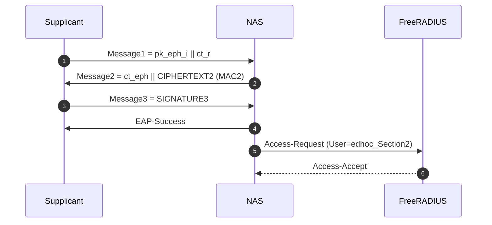
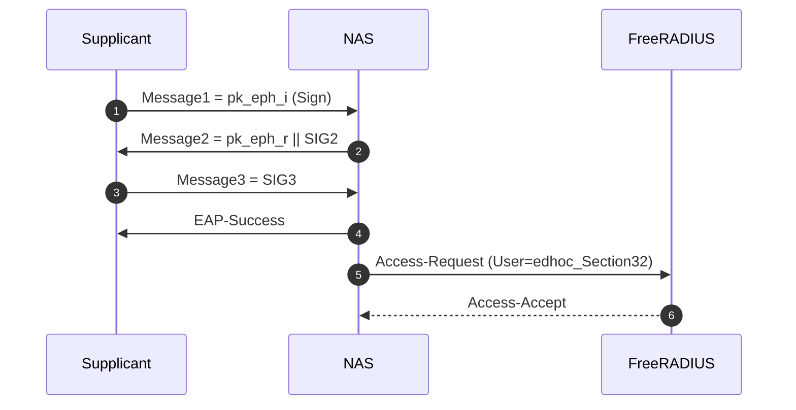
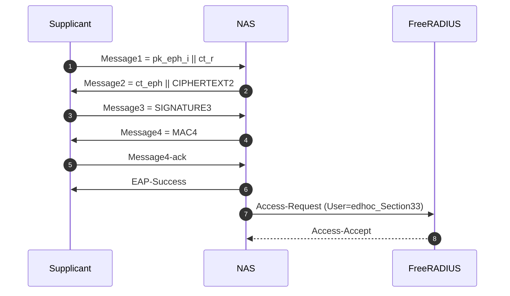
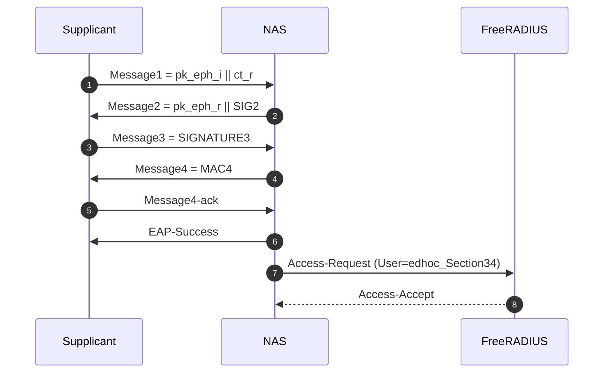
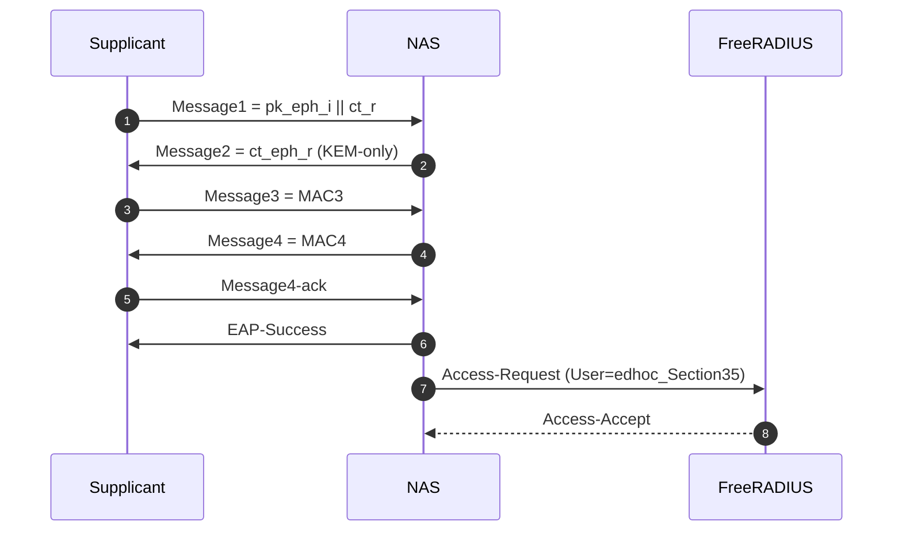
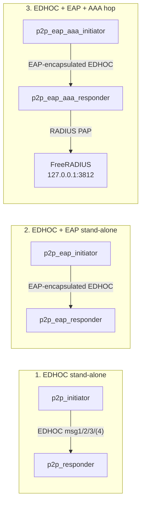

# EDHOC + EAP + AAA (FreeRADIUS) Handshake Mermaid (PAPOn)

Dokumen ini melengkapi `handshake_mermaid_eap_papon.md` dengan dimensi
ke-3 (AAA hop) yang dipakai pada benchmark mode "EAP + AAA". Dalam
mode ini setiap iterasi handshake EDHOC-EAP yang sukses diikuti oleh
satu round-trip RADIUS Access-Request/Access-Accept ke server
FreeRADIUS lokal sehingga kita dapat membandingkan tiga skenario:

1. EDHOC stand-alone (tanpa EAP, tanpa AAA).
2. EDHOC + EAP stand-alone (NAS mengakhiri otentikasi sendiri).
3. EDHOC + EAP + AAA hop (NAS mendelegasikan keputusan ke AAA server).

Implementasi kode terkait:
- `src/aaa_radius.c` / `src/aaa_radius.h` - klien RADIUS PAP minimal
  (RFC 2865 §5.2 + Message-Authenticator RFC 3579 §3.2).
- `src/p2p_eap_responder.c` - hook `aaa_tick(sec)` yang diaktifkan oleh
  `-DBENCH_AAA` (lihat wrapper `src/p2p_eap_aaa_responder.c`).
- `src/p2p_eap_aaa_responder.c` / `src/p2p_eap_aaa_initiator.c` -
  wrapper kompilasi yang mengaktifkan macro `BENCH_AAA` dan tag CSV
  `_aaa`.
- `scripts/freeradius_aaa/prepare.sh` - menyiapkan tree raddb v3 yang
  mendengarkan di UDP/3812 dengan user PAP per section.
- `scripts/freeradius_aaa/run_server.sh` - menjalankan FreeRADIUS
  foreground.

Catatan implementasi benchmark:
- Lima section (Section2, Section32, Section33, Section34, Section35)
  tetap berbagi flow EAP+EDHOC yang sama dengan mode "EAP standalone".
- AAA hop berjalan setelah setiap iterasi handshake EDHOC selesai dan
  setelah `derive_msk_emsk()` dipanggil pada iterasi pertama.
- User name yang dikirim ke FreeRADIUS dipetakan per section
  (`edhoc_Section{2,32,33,34,35}`). Password sama (`edhoc-pass`).
- Hasil per section ditulis ke
  `output/benchmark_aaa_auth_p2p_eap_aaa_responder.csv` dengan kolom
  `calls,accepts,rejects,errors,rtt_avg_us,req_bytes_avg,resp_bytes_avg,total_bytes_avg`.
- CSV "core" mode AAA menggunakan suffix `_aaa` (contoh
  `benchmark_crypto_eap_aaa_responder.csv`,
  `benchmark_fullhandshake_operation_p2p_eap_aaa_initiator.csv`,
  `internal_test_vectors_sections_eap_aaa.csv`).

## Tiga aktor

```mermaid
sequenceDiagram
    autonumber
    participant I as Supplicant<br/>(p2p_eap_aaa_initiator)
    participant N as NAS / Authenticator<br/>(p2p_eap_aaa_responder)
    participant S as AAA Server<br/>(FreeRADIUS @127.0.0.1:3812)

    Note over I,N: Phase 1 - EAP+EDHOC handshake (5 section variant)
    rect rgba(100, 150, 200, 0.10)
    N->>I: EAP-Request/Identity
    I->>N: EAP-Response/Identity
    N->>I: EAP-Request/EDHOC-Start
    end

    rect rgba(120, 200, 120, 0.12)
    I->>N: EAP-Response/EDHOC(Message1)
    N->>I: EAP-Request/EDHOC(Message2)
    I->>N: EAP-Response/EDHOC(Message3)
    opt Section33/34/35
        N->>I: EAP-Request/EDHOC(Message4)
        I->>N: EAP-Response/EDHOC(Message4-ack)
    end
    N->>N: derive_msk_emsk() (iter 0)
    N->>I: EAP-Success
    end

    Note over N,S: Phase 2 - AAA hop (RADIUS PAP, dieksekusi setiap iterasi)
    rect rgba(220, 160, 120, 0.18)
    N->>S: Access-Request<br/>(User-Name=edhoc_Section&lt;N&gt;,<br/> User-Password=PAP, NAS-IP, MA)
    S->>S: Lookup user, verify Cleartext-Password
    S-->>N: Access-Accept<br/>(Message-Authenticator)
    N->>N: aaa_tick(sec):<br/>akumulasi rtt_us, req_bytes, resp_bytes
    end
```

## Per section: EDHOC payload + AAA hop

Karena bagian Phase 1 (EAP+EDHOC per section) sudah terdokumentasi di
[handshake_mermaid_eap_papon.md](handshake_mermaid_eap_papon.md),
diagram di bawah hanya menonjolkan pembeda per section pada bagian
EDHOC payload, lalu memperlihatkan AAA hop yang identik untuk semua
section.

### Section2 (IKR: Sign-KEM)



### Section32 (Sign-(KEM+Sign))



### Section33 (KEM-(KEM+Sign), 4 messages)



### Section34 (KEM-Sign, 4 messages)



### Section35 (KEM-KEM, 4 messages)



## Perbandingan tiga skenario benchmark



CSV pembeda yang dihasilkan tiap skenario:
| Skenario | Suffix CSV | Tambahan |
| --- | --- | --- |
| EDHOC stand-alone | `*_initiator.csv` / `*_responder.csv` | - |
| EDHOC + EAP | `*_eap_initiator.csv` / `*_eap_responder.csv` | fragmentasi + keymat |
| EDHOC + EAP + AAA | `*_eap_aaa_initiator.csv` / `*_eap_aaa_responder.csv` | + `benchmark_aaa_auth_p2p_eap_aaa_responder.csv` |
