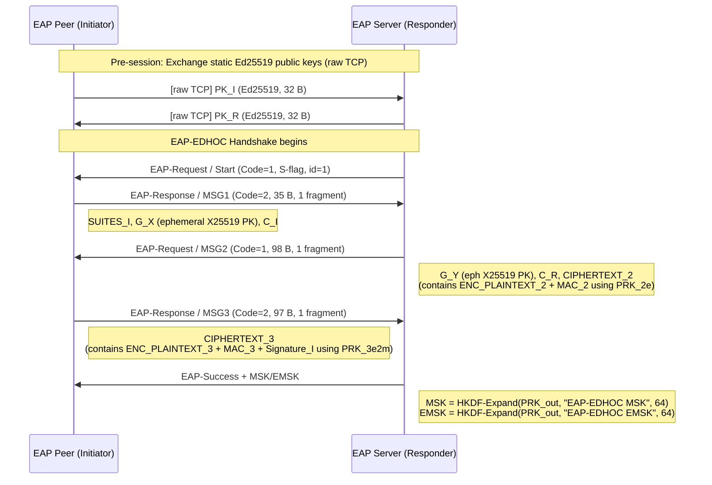
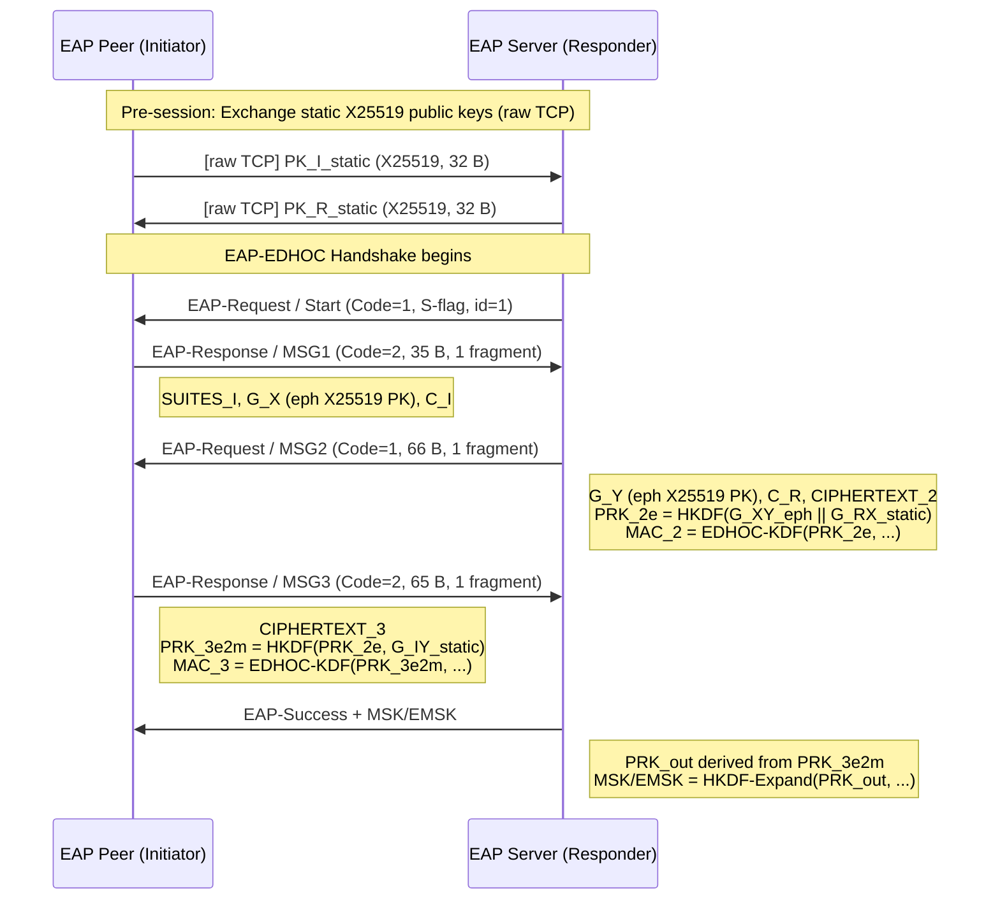
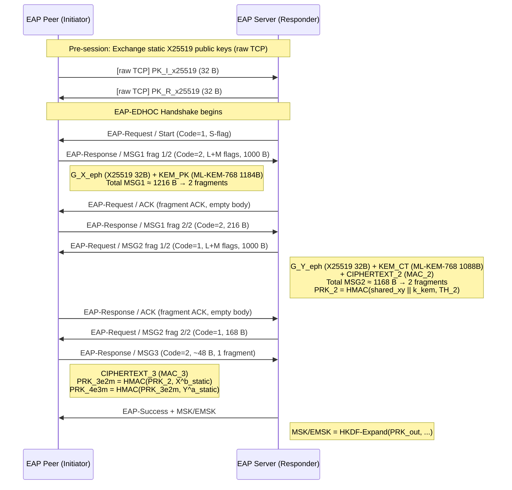
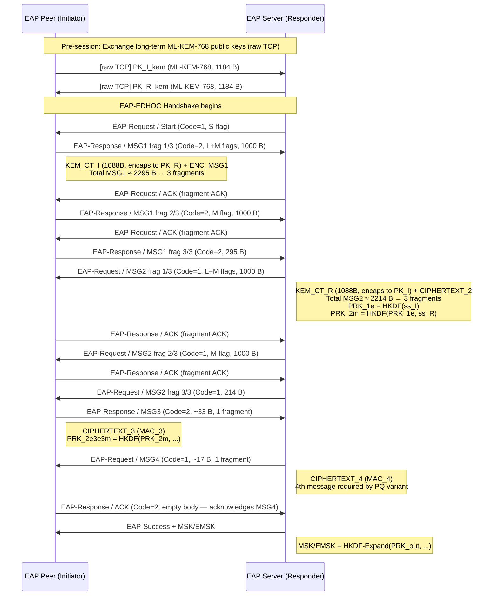
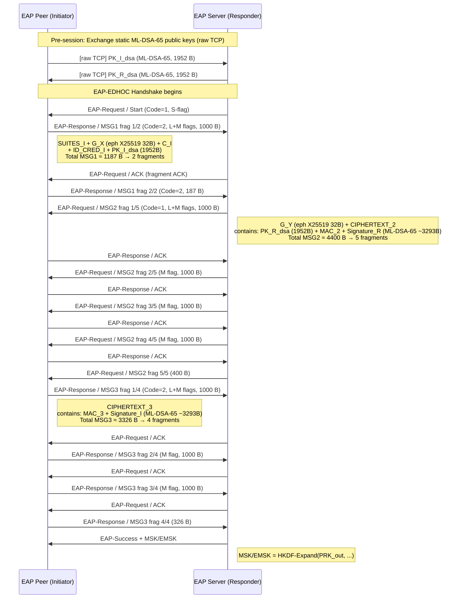
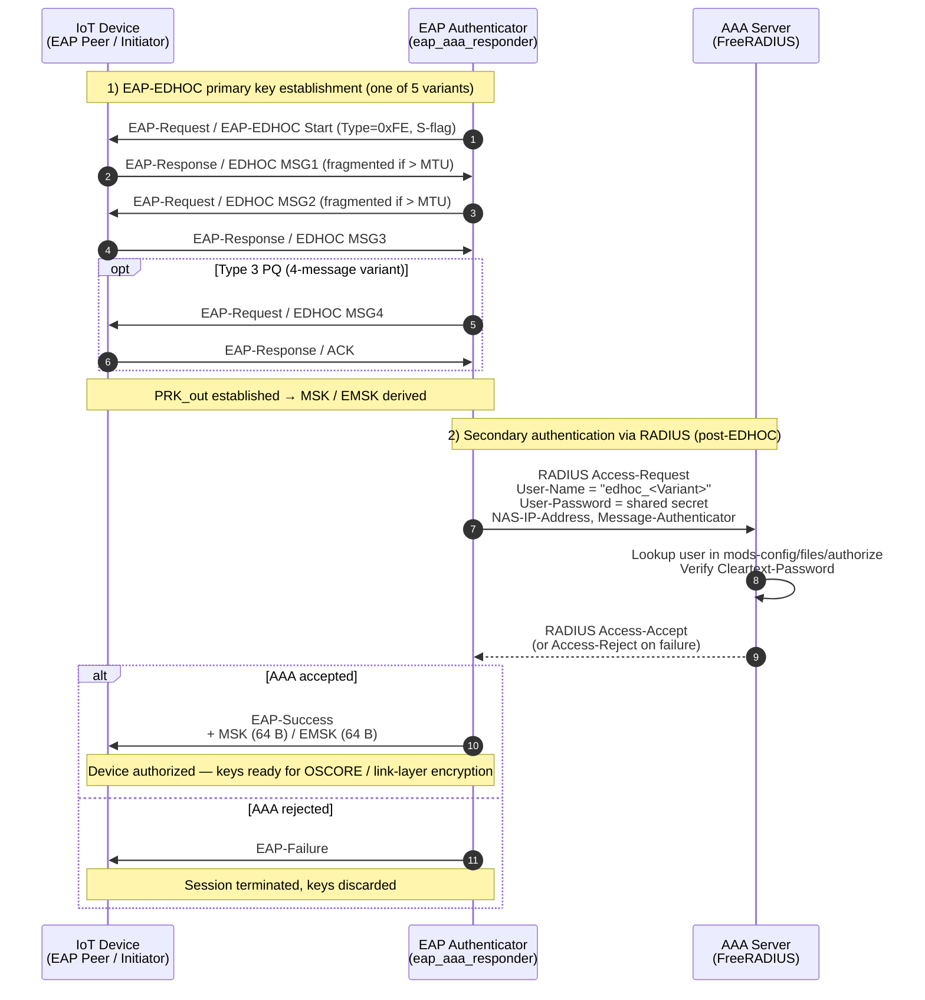

# EAP-EDHOC Handshake Diagrams (Primary Authentication)

> **Scope:** dokumen ini menggambarkan **primary authentication** —
> EAP-EDHOC dipakai untuk network access (link-layer) dengan FreeRADIUS sebagai
> backend AAA operator. Output kunci: `MSK` / `EMSK`.
>
> Untuk **secondary authentication** (EAP-EDHOC ke service / DN-AAA setelah
> device sudah ter-attach, dengan opsi *channel-binding* via EMSK primary,
> dan output Application Key untuk OSCORE) lihat file terpisah:
> [handshake_mermaid_eap_secondary_authentication.md](handshake_mermaid_eap_secondary_authentication.md).

Sequence diagrams for all 5 EDHOC variants wrapped in **EAP-EDHOC** framing
per [draft-ietf-emu-eap-edhoc].

- **EAP Method Type:** `0xFE` (Experimental)
- **Transport:** TCP with 2-byte length prefix
- **EAP MTU:** 1000 bytes/fragment (L/M/S flags for fragmentation)
- **MSK/EMSK:** Derived from EDHOC `PRK_out` after successful handshake

---

## Benchmark Results (loopback, 100 iterations)

| Rank | Variant | Total (µs) | Processing (µs) | Tx/Rx (µs) |
|------|---------|-----------|----------------|------------|
| 1 | Type 0 Classic | 258.92 | 83.56 | 87.41 |
| 2 | Type 3 Classic | 277.88 | 93.02 | 103.56 |
| 3 | Type 3 Hybrid | 800.12 | 268.16 | 330.38 |
| 4 | Type 3 PQ | 1369.88 | 510.19 | 707.03 |
| 5 | Type 0 PQ | 4326.39 | 1937.36 | 1870.48 |

---

## Legend

```
I = EAP Peer   (Initiator, EAP Supplicant side)
R = EAP Server (Responder, EAP Authenticator side)
[frag 1/N] = EAP fragment (M-bit set if more fragments follow)
MSK/EMSK   = derived from PRK_out via HKDF (64 bytes each)
```

---

## 1. Type 0 Classic — Ed25519 Sig-Sig (fastest in EAP context)

Cipher suite: EDHOC Method 0, Ed25519 static keys for authentication.
All messages fit in a single EAP fragment (≤ 1000 bytes).



**EAP Round Trips:** 3 (Start → MSG1 → MSG2 → MSG3 → Success)

---

## 2. Type 3 Classic — X25519 MAC-MAC

Cipher suite: EDHOC Method 3, X25519 static keys, MAC-only authentication (no signatures).
All messages fit in a single EAP fragment.



**EAP Round Trips:** 3 | **Key Exchange:** 2× X25519 ECDH (eph+static) | **Auth:** HMAC-SHA256 MAC

---

## 3. Type 3 Hybrid — X25519 + ML-KEM-768 (Hybrid PQ)

Cipher suite: EDHOC Method 3 hybrid variant. Combines X25519 ECDHE with ML-KEM-768 encapsulation for post-quantum forward secrecy. Large messages require multiple EAP fragments.



**EAP Round Trips:** 5 (3 msg + 2 fragment ACKs) | **Key Exchange:** X25519 + ML-KEM-768 | **Auth:** HMAC-SHA256 MAC

---

## 4. Type 3 PQ — ML-KEM-768 Encrypted MSG1 (4-message)

Cipher suite: EDHOC Method 3 PQ variant. MSG1 is encrypted using Responder's long-term KEM public key, providing forward secrecy and identity protection. Uses 4 EDHOC messages requiring an extra EAP round trip.



**EAP Round Trips:** 10 (4 EDHOC msgs + 4 fragment ACKs + MSG4-ACK + Success) | **Auth:** ML-KEM-768 (PQ-secure)

---

## 5. Type 0 PQ — ML-DSA-65 Sig-Sig (slowest)

Cipher suite: EDHOC Method 0 with ML-DSA-65 (Dilithium3) post-quantum signatures for mutual authentication. Large public keys and signatures require many EAP fragments.



**EAP Round Trips:** 14 (3 EDHOC msgs + 11 fragment ACKs) | **Auth:** ML-DSA-65 (PQ signatures)

---

## EAP Packet Format

```
 0                   1                   2                   3
 0 1 2 3 4 5 6 7 8 9 0 1 2 3 4 5 6 7 8 9 0 1 2 3 4 5 6 7 8 9 0 1
+-+-+-+-+-+-+-+-+-+-+-+-+-+-+-+-+-+-+-+-+-+-+-+-+-+-+-+-+-+-+-+-+
|     Code      |  Identifier   |            Length             |
+-+-+-+-+-+-+-+-+-+-+-+-+-+-+-+-+-+-+-+-+-+-+-+-+-+-+-+-+-+-+-+-+
|     Type      |     Flags     |   Total-Length (if L-bit)     |
|  (0xFE/254)   | L|M|S|0|0|0|0|         (4 bytes)             |
+-+-+-+-+-+-+-+-+-+-+-+-+-+-+-+-+-+-+-+-+-+-+-+-+-+-+-+-+-+-+-+-+
|                         EAP-EDHOC Data                        |
+-+-+-+-+-+-+-+-+-+-+-+-+-+-+-+-+-+-+-+-+-+-+-+-+-+-+-+-+-+-+-+-+

Code:  1=Request, 2=Response, 3=Success, 4=Failure
Flags: L=Length-included, M=More-fragments, S=EAP-Start
TCP:   each EAP packet prefixed with 2-byte big-endian length
```

## MSK/EMSK Derivation

After a successful EDHOC handshake, the EAP server exports keying material:

```
MSK  (64B) = EDHOC-Expand(PRK_out, "EAP-EDHOC MSK",  13, 64)
EMSK (64B) = EDHOC-Expand(PRK_out, "EAP-EDHOC EMSK", 14, 64)
```

where `EDHOC-Expand` is `HKDF-Expand(PRK_out, context_string || length, outlen)`.

---

## Secondary Authentication via FreeRADIUS AAA

The diagram below shows the **complete secondary-authentication flow** as
implemented in [src/benchmark_eap_responder_aaa.c](../src/benchmark_eap_responder_aaa.c)
and [src/benchmark_eap_initiator.c](../src/benchmark_eap_initiator.c). The IoT
device (EAP Peer / Initiator) performs an EAP-EDHOC handshake with the EAP
Authenticator (Responder), which then validates the device's identity against a
back-end FreeRADIUS server using the standard RADIUS Access-Request/Accept
exchange before granting network access.



### Mapping ke Code

| Komponen | File | Fungsi utama |
|---|---|---|
| EAP Peer (IoT device) | [src/benchmark_eap_initiator.c](../src/benchmark_eap_initiator.c) | `run_handshake_benchmarks()`, `eap_send_response()` |
| EAP Authenticator | [src/benchmark_eap_responder_aaa.c](../src/benchmark_eap_responder_aaa.c) | `wait_for_client()`, `aaa_authenticate_variant()` |
| EAP layer & fragmentation | [src/eap_layer.c](../src/eap_layer.c) | `eap_send()`, `eap_recv()`, `eap_derive_msk_emsk()` |
| Per-variant EDHOC handshake | [src/eap_variant_type0_classic.c](../src/eap_variant_type0_classic.c) … `_type3_hybrid.c` | `run_eap_<variant>_initiator/_responder()` |
| AAA prepare script | [scripts/freeradius_aaa/prepare.sh](../scripts/freeradius_aaa/prepare.sh) | Setup FreeRADIUS raddb dengan port 3812 + EDHOC users |
| AAA run script | [scripts/freeradius_aaa/run_debug.sh](../scripts/freeradius_aaa/run_debug.sh) | Jalankan `freeradius -X` (debug mode) |
| AAA smoke test | [scripts/freeradius_aaa/smoke_test.sh](../scripts/freeradius_aaa/smoke_test.sh) | `radclient` Access-Request manual |

### Compliance dengan draft-ietf-emu-eap-edhoc

| Aspek draft | Implementasi |
|---|---|
| EAP Method Type | `0xFE` (Experimental, sesuai §3.1 draft) |
| EAP Header Flags | `L` (Length), `M` (More), `S` (Start) — `eap_layer.c` |
| Fragmentation MTU | Default `EAP_EDHOC_MTU = 1000 B` (§3.2) |
| EDHOC message flow | MSG1/MSG2/MSG3 (+MSG4 untuk method 3 PQ) |
| MSK derivation | `MSK  = EDHOC-Expand(PRK_out, "EAP-EDHOC MSK", 13, 64)` (§4) |
| EMSK derivation | `EMSK = EDHOC-Expand(PRK_out, "EAP-EDHOC EMSK", 14, 64)` (§4) |
| AAA back-end | FreeRADIUS via `radclient` (RFC 2865 Access-Request/Accept) |
