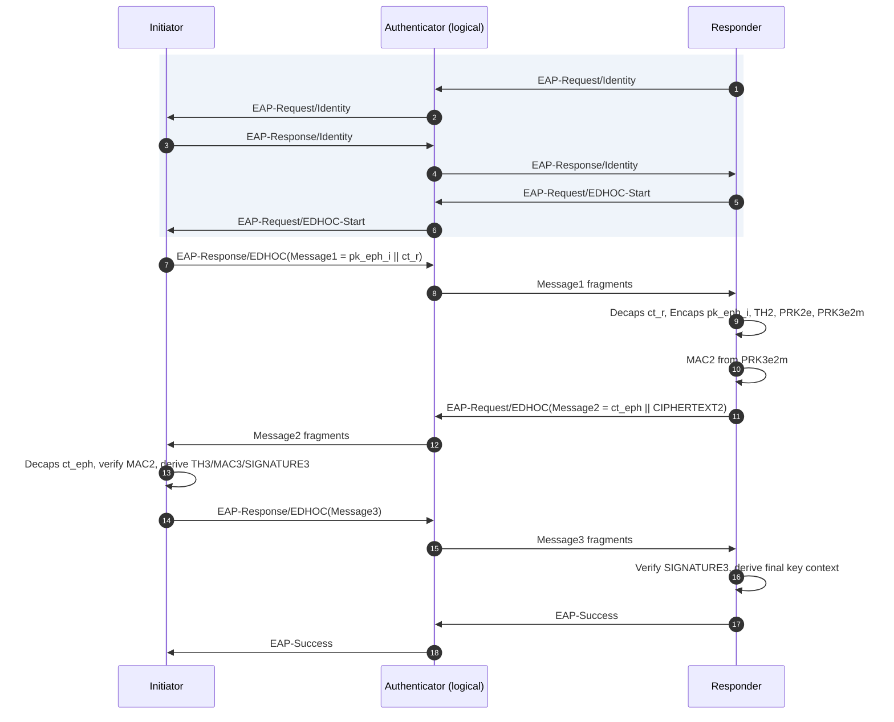
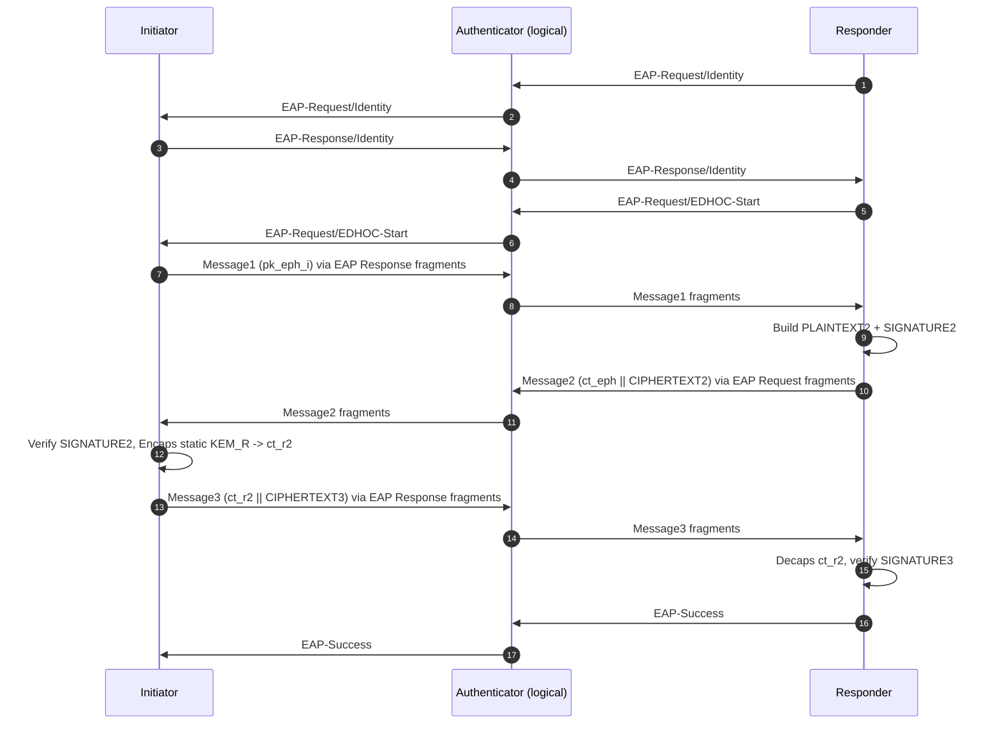
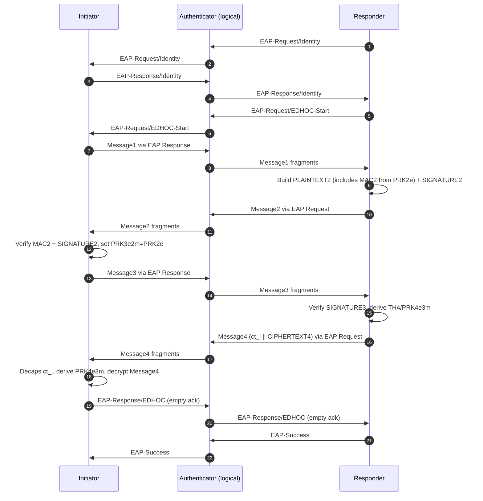
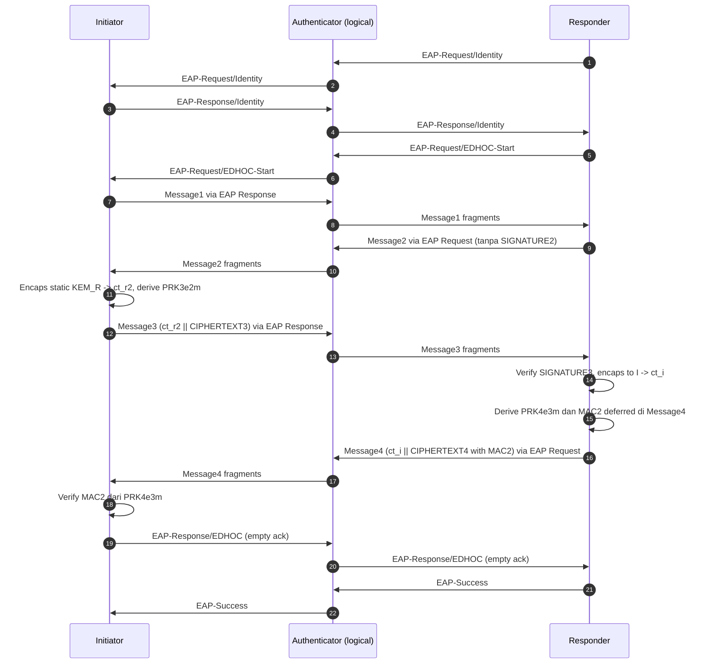
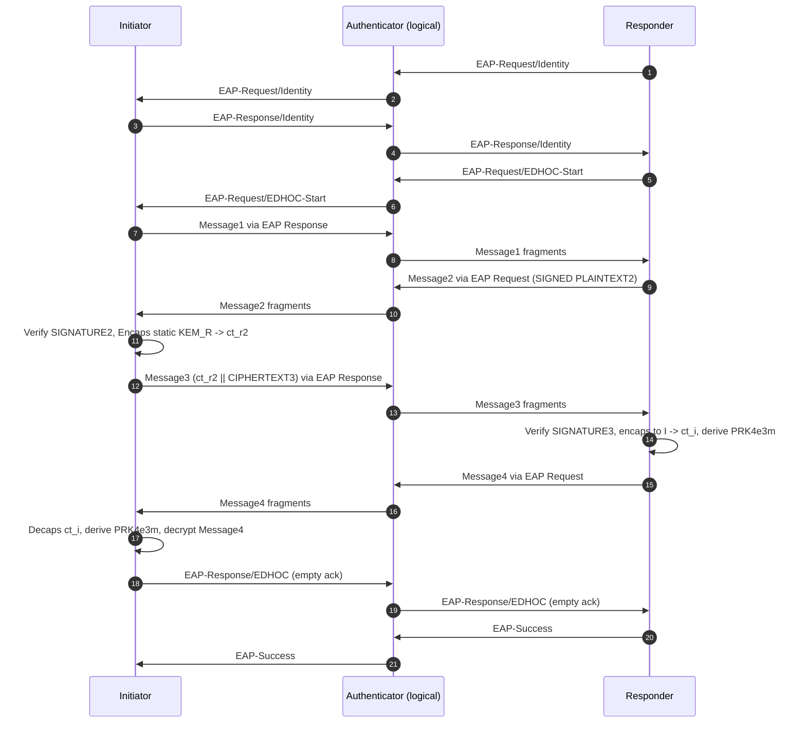

# EAP Standalone Handshake Mermaid (PAPOn)

Dokumen ini menjelaskan flow benchmark EAP-standalone yang membungkus alur EDHOC existing untuk Section2, Section32, Section33, Section34, dan Section35.

Implementasi kode terkait:
- src/p2p_eap_initiator.c
- src/p2p_eap_responder.c
- src/eap_wrap.c

Catatan implementasi benchmark:
- Flow kriptografi EDHOC per section tetap sama dengan varian non-EAP.
- Pembungkus EAP dilakukan untuk pesan benchmark (credential exchange + Message1/2/3/4) dengan EAP Request/Response semantics.
- Ada fase EAP Identity, EAP-Request/EDHOC-Start, dan EAP-Success.
- Fragmentasi EAP aktif berbasis MTU (`mtu` CLI), dengan reassembly di sisi penerima.
- EAP Method Type dapat dikonfigurasi via CLI (default suggested draft `57`).
- Setelah tiap section selesai, benchmark menurunkan MSK/EMSK dari key schedule final dan menulis CSV output.
- Profil benchmark ini mempertahankan pola Message4 sesuai varian code saat ini: Section33/34/35 mengirim Message4, Section2/32 tidak.

## Section2 (IKR: Sign-KEM)

## Section32 (Sign-(KEM+Sign))

## Section33 ((KEM+Sign)-Sign)

## Section34 ((KEM+Sign)-KEM)

## Section35 ((KEM+Sign)-(KEM+Sign))

## Fragmentasi EAP (MTU)

Aturan di implementasi wrapper:
- Payload EDHOC dipecah menjadi beberapa EAP packet jika melebihi `mtu`.
- Tiap fragmen membawa `flags` bitfield `R|S|M|L` dan `edhoc_type` (Message1..4 atau credential exchange).
- `L` bits dipakai pada fragmen pertama untuk mengindikasikan panjang field EDHOC-message-length (saat terfragmentasi).
- Penerima melakukan reassembly berdasarkan `identifier` EAP dan `edhoc_type`.

## Method Type dan Keluaran Kunci

- Method Type EAP dapat dipilih lewat argumen CLI.
- Nilai default memakai Method Type `57` (suggested value di draft).
- Setelah tiap section selesai, key schedule final dipakai untuk turunkan:
  - `MSK` (64 byte)
  - `EMSK` (64 byte)
- Output ditulis ke CSV:
  - output/benchmark_eap_keymat_initiator.csv
  - output/benchmark_eap_keymat_responder.csv
