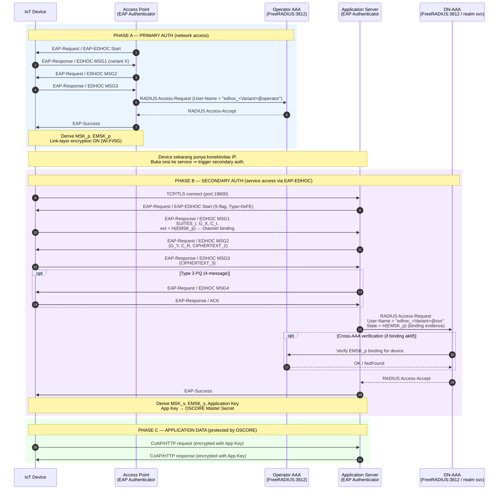

# EAP-EDHOC **Secondary Authentication** Handshake Diagrams

> Dokumen ini melengkapi [handshake_mermaid_eap.md](handshake_mermaid_eap.md)
> yang berisi **primary authentication** (network access). File ini fokus pada
> **secondary authentication**: setelah device sudah ter-attach ke jaringan,
> ia harus membuktikan identitasnya lagi ke server/service tertentu sebelum
> diizinkan mengakses application data.

---

## 1. Definisi & Perbedaan dengan Primary

| Aspek | Primary Authentication | Secondary Authentication |
|---|---|---|
| Tujuan | Boleh **konek ke jaringan** (link-layer / NAS) | Boleh **konek ke server / service tertentu** (app-layer) |
| Pemicu | Device join jaringan (Wi-Fi assoc, 5G registration) | Device buka sesi PDU / akses Data Network (DN) tertentu |
| AAA backend | Home AAA (operator) | DN-AAA (service provider, mis. enterprise/IoT cloud) |
| Output kunci | `MSK` → PMK / K_NAS (link-layer) | `MSK_2` → kunci sesi service + Application Key (OSCORE) |
| Identitas | NAI level operator (mis. `device@operator.id`) | NAI level service (mis. `dev123@iot-cloud.example`) |
| Standar | RFC 3748, IEEE 802.1X | 3GPP TS 33.501 §11, draft-ietf-emu-eap-edhoc §6 |
| Posisi EDHOC | EAP method `0xFE` di EAPOL / RADIUS | EAP method `0xFE` di-tunnel via PDU session |

**Inti perbedaan:** primary memvalidasi *"boleh akses jaringan?"*, secondary
memvalidasi *"boleh akses service ini?"*. Keduanya bisa pakai EAP-EDHOC tetapi
terhadap AAA server yang berbeda dan dengan kunci yang berbeda.

---

## 2. Hubungan & Key Continuity

Primary dan secondary **bisa independen** atau **terikat (cryptographic
binding)** lewat material kunci yang diturunkan dari primary.

```
Primary EAP-EDHOC                  Secondary EAP-EDHOC
─────────────────                  ───────────────────
PRK_out_primary                    PRK_out_secondary
  ├─ MSK_p  (link-layer)             ├─ MSK_s  (service session)
  └─ EMSK_p ──┐               ┌──── └─ Application Key (OSCORE MS)
              │               │
              └──► PSK_input ──┘  (opsional channel-binding)
                   atau "ext" field di EDHOC MSG1
```

- **Tanpa binding** → secondary jalan murni dengan static keys baru (PK_DN,
  PK_DEV_service). Aman, tapi server tidak tahu sesi ini berasal dari device
  yang sama yang sudah primary-auth.
- **Dengan binding** → `EMSK_primary` di-feed sebagai `PSK` atau `ext` field di
  EDHOC MSG1 secondary (`G1` = G_X || H(EMSK_primary)). DN-AAA bisa minta
  primary AAA untuk verifikasi → mencegah service-stealing attack.

> **Application Key** sendiri **tidak dipakai** di secondary handshake;
> Application Key justru *output* dari secondary (untuk OSCORE app data).
> Yang dipakai sebagai *input* binding adalah **EMSK** dari primary.

---

## 3. Sequence Diagram: As-Implemented Flow (Current Code)



---

## 4. Sequence Diagram: Secondary Auth Saja (Zoom-in, As Implemented)

Diagram ini mengikuti urutan aktual di kode saat ini.

```mermaid
sequenceDiagram
    autonumber
    participant DEV as IoT Device<br/>(EAP Peer)
    participant SRV as Application Server<br/>(EAP Authenticator)
    participant AAA as DN-AAA<br/>(FreeRADIUS)

    Note over DEV,AAA: INIT AND PRECONDITION
    Note over DEV: Set variant and static credential (per varian)
    Note over SRV: Set AAA endpoint, secret, and EDHOC_AAA_REQUIRE
    Note over AAA: Set users for edhoc_<variant> in authorize file

    DEV->>SRV: TCP Connect (dst port 19600)
    Note over DEV: Set transport framing = 2-byte length + EAP packet

    Note over SRV: EAP START
    Note over SRV: Generate id_start as 1-byte identifier
    Note over SRV: Set pkt_start = eap_build_packet(Code=1, Type=0xFE, Flags=S, id=id_start)
    SRV->>DEV: EAP-Request/Start (Code=1, Type=0xFE, Flags=S, id=1)

    Note over DEV: BUILD MSG1
    Note over DEV: Parse Start and verify Code=Request and S flag
    Note over DEV: Generate (x, X) = ecdhe.keygen()
    Note over DEV: Set C_I = random connection identifier
    Note over DEV: Set MSG1 = (SUITES_I, G_X, C_I)
    Note over DEV: Compute len_msg1 and set L/M flags when len_msg1 exceeds MTU
    DEV->>SRV: EAP-Response/MSG1 (Code=2, id=1, Type=0xFE)

    Note over SRV: PROCESS MSG1 AND BUILD MSG2
    Note over SRV: Parse and reassemble MSG1 fragments if M flag is set
    Note over SRV: Parse fields from MSG1 = (SUITES_I, G_X, C_I)
    Note over SRV: Set selected_suite from SUITES_I
    Note over SRV: Generate (y, Y) = ecdhe.keygen()
    Note over SRV: Set C_R = random connection identifier
    Note over SRV: Compute TH_2 = H(Y, MSG1, C_R)
    Note over SRV: Compute G_XY = ecdhe(y, G_X)
    Note over SRV: Compute PRK_2e = extract(G_XY, TH_2)
    Note over SRV: Compute G_X_svc = ecdhe(SK_SRV_svc, G_X)
    Note over SRV: Compute PRK_3e2m = extract(G_X_svc, PRK_2e)
    Note over SRV: Compute MK_2 = expand(PRK_3e2m, TH_2, label_mk2)
    Note over SRV: Compute MAC_2 = kdf(MK_2, C_R, ID_CRED_R, TH_2, PK_SRV_svc, EAD_2)
    Note over SRV: Compute EK_2 = expand(PRK_2e, TH_2, label_ek2)
    Note over SRV: Set PLAINTEXT_2 = (ID_CRED_R, MAC_2, EAD_2)
    Note over SRV: Set CIPHERTEXT_2 = aead_enc(EK_2, TH_2, PLAINTEXT_2)
    SRV->>DEV: EAP-Request/MSG2 (id=2, G_Y, CIPHERTEXT_2)

    Note over DEV: PROCESS MSG2 AND BUILD MSG3
    Note over DEV: Compute G_XY = ecdhe(x, G_Y)
    Note over DEV: Compute TH_2 = H(G_Y, MSG1, C_R)
    Note over DEV: Compute PRK_2e = extract(G_XY, TH_2)
    Note over DEV: Compute EK_2 = expand(PRK_2e, TH_2, label_ek2)
    Note over DEV: Parse PLAINTEXT_2 = aead_dec(EK_2, TH_2, CIPHERTEXT_2)
    Note over DEV: Parse fields from PLAINTEXT_2 = (ID_CRED_R, MAC_2, EAD_2)
    Note over DEV: Set PK_SRV_svc from ID_CRED_R lookup
    Note over DEV: Compute G_X_svc = ecdhe(x, PK_SRV_svc)
    Note over DEV: Compute PRK_3e2m = extract(G_X_svc, PRK_2e)
    Note over DEV: Compute MK_2 = expand(PRK_3e2m, TH_2, label_mk2)
    Note over DEV: Verify MAC_2 using MK_2 and transcript fields
    Note over DEV: Compute TH_3 = H(TH_2, PLAINTEXT_2, PK_SRV_svc)
    Note over DEV: Compute G_Y_svc = ecdhe(SK_DEV_svc, G_Y)
    Note over DEV: Compute PRK_4e3m = extract(G_Y_svc, PRK_3e2m)
    Note over DEV: Compute MK_3 = expand(PRK_4e3m, TH_3, label_mk3)
    Note over DEV: Compute MAC_3 = kdf(MK_3, ID_CRED_I, TH_3, PK_DEV_svc, EAD_3)
    Note over DEV: Compute EK_3 = expand(PRK_3e2m, TH_3, label_ek3)
    Note over DEV: Set PLAINTEXT_3 = (ID_CRED_I, MAC_3, EAD_3)
    Note over DEV: Set CIPHERTEXT_3 = aead_enc(EK_3, TH_3, PLAINTEXT_3)
    DEV->>SRV: EAP-Response/MSG3 (id=2, CIPHERTEXT_3)

    opt Type3_PQ_4msg
        Note over SRV: PROCESS MSG3 AND BUILD MSG4
        Note over SRV: Compute TH_3 = H(TH_2, PLAINTEXT_2, PK_SRV_svc)
        Note over SRV: Compute EK_3 = expand(PRK_3e2m, TH_3, label_ek3)
        Note over SRV: Parse PLAINTEXT_3 = aead_dec(EK_3, TH_3, CIPHERTEXT_3)
        Note over SRV: Compute G_Y_svc = ecdhe(y, PK_DEV_svc)
        Note over SRV: Compute PRK_4e3m = extract(G_Y_svc, PRK_3e2m)
        Note over SRV: Compute MK_3 = expand(PRK_4e3m, TH_3, label_mk3)
        Note over SRV: Verify MAC_3
        Note over SRV: Compute TH_4 = H(TH_3, PLAINTEXT_3, PK_DEV_svc)
        Note over SRV: Compute MK_4 = expand(PRK_4e3m, TH_4, label_mk4)
        Note over SRV: Compute MAC_4 = kdf(MK_4, TH_4, EAD_4)
        Note over SRV: Set CIPHERTEXT_4 = aead_enc(PRK_4e3m, TH_4, MAC_4)
        SRV->>DEV: EAP-Request/MSG4 (id=3, CIPHERTEXT_4)
        Note over DEV: Verify MAC_4 from CIPHERTEXT_4
        DEV->>SRV: EAP-Response/ACK (id=3, empty)
    end

    Note over DEV,SRV: SESSION KEY DERIVATION
    Note over DEV,SRV: Compute PRK_out_s = expand(PRK_4e3m, TH_final)
    Note over DEV,SRV: Compute MSK_s = EDHOC-Expand(PRK_out_s, label_msk, 64)
    Note over DEV,SRV: Compute EMSK_s = EDHOC-Expand(PRK_out_s, label_emsk, 64)
    Note over DEV,SRV: AppKey exporter OSCORE explicit belum diimplementasi di benchmark

    Note over SRV: Send EAP-Success dulu dari handler varian
    SRV->>DEV: EAP-Success (Code=3, Len=4)

    Note over SRV,AAA: FINAL RADIUS AUTHORIZATION
    Note over SRV: Set User-Name = edhoc_variant
    Note over SRV: Set User-Password = edhoc-pass
    Note over SRV: Set NAS-IP-Address = 127.0.0.1
    Note over SRV: Set Service-Type = Framed-User
    SRV->>AAA: RADIUS Access-Request (final)

    alt Access-Accept
        AAA-->>SRV: Access-Accept
        Note over SRV: Set authorized = true
    else Access-Reject
        AAA-->>SRV: Access-Reject
        Note over SRV: If EDHOC_AAA_REQUIRE=1 then stop benchmark loop
        Note over SRV: Tidak ada EAP-Failure tambahan yang dikirim ke DEV
    end

    Note over DEV,SRV: PROTECTED APPLICATION DATA
    Note over DEV,SRV: Out-of-scope benchmark saat ini (tidak ada OSCORE data-path)
```



---

## 5. Mapping ke Code (kondisi saat ini & gap)

| Komponen | Status | File / catatan |
|---|---|---|
| EAP-EDHOC handshake (5 variant) | ✅ Terimplementasi | [src/eap_variant_*.c](../src/) |
| EAP framing & MSK/EMSK derivation | ✅ Terimplementasi | [src/eap_layer.c](../src/eap_layer.c) — `eap_derive_msk_emsk()` |
| Authenticator + AAA (RADIUS) | ✅ Terimplementasi (primary mode) | [src/benchmark_eap_responder_aaa.c](../src/benchmark_eap_responder_aaa.c) |
| Two-phase (primary + secondary) split | ❌ Belum — saat ini hanya 1 phase | Perlu binary `eap_secondary_initiator` & `eap_secondary_responder` terpisah |
| Channel binding via `EAD_1 = H(EMSK_p)` | ❌ Belum | Belum ada di `src/eap_variant_*.c` saat ini |
| Application Key (OSCORE MS) export | ❌ Belum | Panggil `edhoc_exporter("OSCORE_Master_Secret", 16, ...)` setelah handshake |
| DN-AAA realm terpisah dari Operator AAA | ❌ Belum | Tambah realm `@svc` di FreeRADIUS proxy.conf |
| Cross-AAA verification (binding lookup) | ❌ Belum | Custom RADIUS module / Perl unlang policy |

---

## 6. Compliance dengan Standar

| Aspek | Standar | Status diagram ini |
|---|---|---|
| EAP method type 0xFE | draft-ietf-emu-eap-edhoc §3.1 | ✅ |
| Secondary auth dalam PDU session | 3GPP TS 33.501 §11 (Annex U) | ✅ alur sesuai |
| EAP-EDHOC channel binding via EAD | RFC 9528 §3.8 (EAD_1) | ⚠️ Target design, belum diimplementasi |
| Application Key export | RFC 9528 §4.2 (`EDHOC-Exporter`) | ⚠️ Target design, belum diimplementasi |
| RADIUS Access-Request/Accept | RFC 2865 / RFC 3579 (EAP over RADIUS) | ✅ |

---

## 7. Ringkasan Jawaban Pertanyaan

> **Q1: Mermaid yang ada itu primary atau secondary?**
> A: Yang sudah ada = **primary authentication** (EAP-EDHOC untuk network
> access dengan FreeRADIUS sebagai backend AAA). Section "Secondary
> Authentication via FreeRADIUS AAA" di file lama itu sebenarnya juga primary
> — penamaan kurang tepat.

> **Q2: Apa primary dan secondary punya hubungan?**
> A: Ya. Hubungan utama lewat **EMSK** dari primary yang di-feed sebagai
> *channel-binding input* (mis. `H(EMSK_p)` di field `EAD_1`) pada secondary
> EDHOC MSG1. Tujuannya supaya server service tahu device ini sudah lulus
> primary auth.

> **Q3: Apakah Application Key primary dipakai di secondary?**
> A: **Tidak.** Application Key justru **output dari secondary** (jadi OSCORE
> master secret untuk app data). Yang menjadi *input binding* dari primary
> adalah **EMSK_primary**, bukan Application Key.
