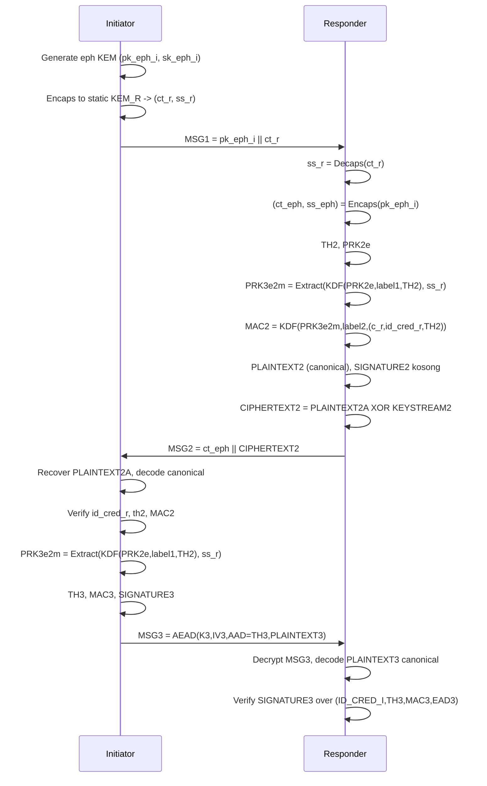
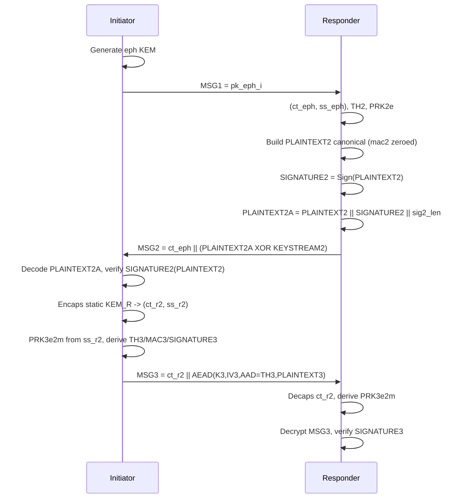
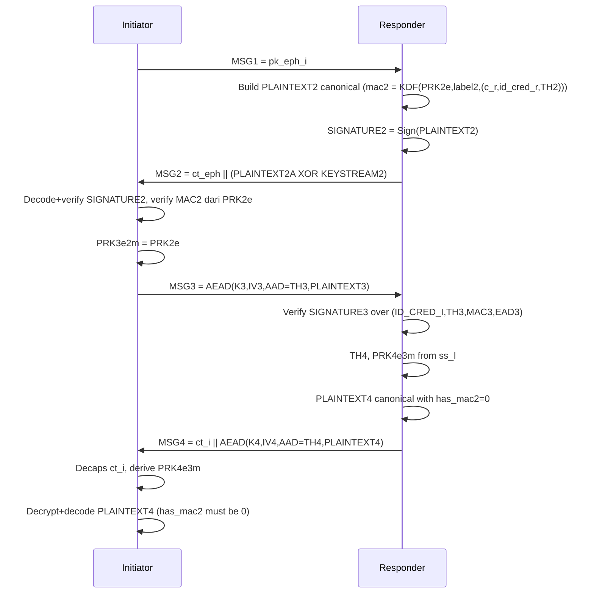
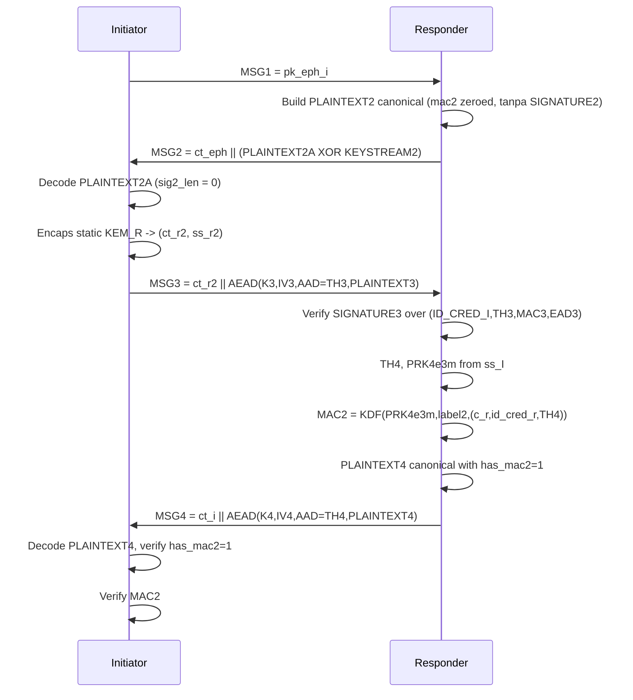
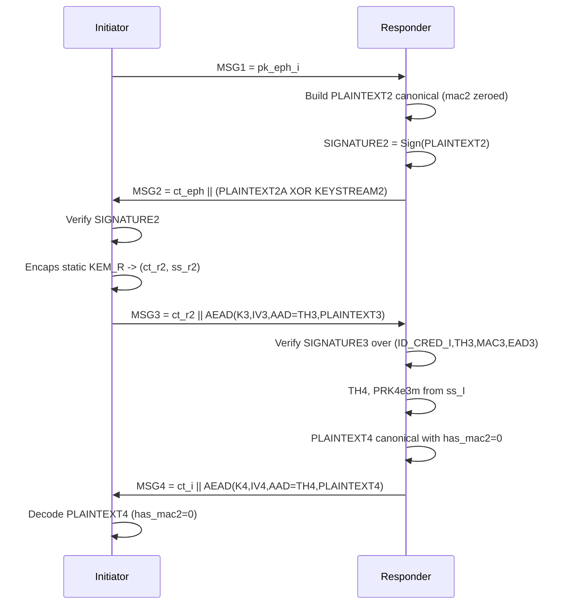

# Real Code Mermaid Flow (Section2, Section32, Section33, Section34, Section35)

Dokumen ini sudah disinkronkan dengan implementasi terbaru di:
- src/p2p_initiator.c
- src/p2p_responder.c
- src/edhoc_plaintext.c

## Canonical Format yang Dibekukan di Kode

### PLAINTEXT_2
Urutan field (canonical internal):
1. `c_r` (1 byte)
2. `id_cred_r` (32 byte)
3. `th2` (32 byte)
4. `mac2` (32 byte)
5. `ead_len` (u16, big-endian)
6. `ead` (0..65535 byte)

### PLAINTEXT_2A
`PLAINTEXT_2 || SIGNATURE_2 || sig2_len(u16)`

### PLAINTEXT_3
1. `id_cred_i` (32 byte)
2. `sig3_len` (u16)
3. `sig3`
4. `ead_len` (u16)
5. `ead`

### PLAINTEXT_4
1. `has_mac2` (1 byte)
2. `mac2` (32 byte)
3. `ead_len` (u16)
4. `ead`

Catatan implementasi:
- Pada section tanpa MAC_2 di pesan tertentu, field `mac2` tetap ada (diisi nol) agar format tetap canonical.
- `ead` saat ini dikirim kosong (`ead_len = 0`) di semua section.
- `ID_CRED_R` dipilih sesuai mode autentikasi responder: hash `kem_pk_R` untuk Section2/34, hash `sign_pk_R` untuk Section32/33/35.

## Konvensi KDF / Transcript (Sesuai Kode)
- `ID_CRED_I = SHA-256(sign_pk_I)`
- `ID_CRED_R = SHA-256(kem_pk_R)` untuk Section2/34, dan `SHA-256(sign_pk_R)` untuk Section32/33/35
- `TH_2 = H(kem.ct_eph || H(MSG1))`
- `KEYSTREAM_2 = KDF(PRK_2e, label=0, context=TH_2, len=|PLAINTEXT_2A|)`
- `SALT_3e2m = KDF(PRK_2e, label=1, context=TH_2, len=32)`
- `PRK_3e2m = Extract(SALT_3e2m, ss_R)` untuk Section2/32/34/35
- `PRK_3e2m = PRK_2e` untuk Section33
- `TH_3 = H(TH_2 || PLAINTEXT_2 || ID_CRED_R)`
- `MAC_3 = KDF(PRK_3e2m, label=6, context=(ID_CRED_I || TH_3), len=32)`
- `TH_4 = H(TH_3 || PLAINTEXT_3 || ID_CRED_I)`
- `SALT_4e3m = KDF(PRK_3e2m, label=5, context=TH_4, len=32)`
- `PRK_4e3m = Extract(SALT_4e3m, ss_I)`
- `K_3/IV_3` dan `K_4/IV_4` dari label `8/9`

## Section2 (Sign-KEM)

## Section32 (Sign-(KEM+Sign))

## Section33 ((KEM+Sign)-Sign)

## Section34 ((KEM+Sign)-KEM)

## Section35 ((KEM+Sign)-(KEM+Sign))

